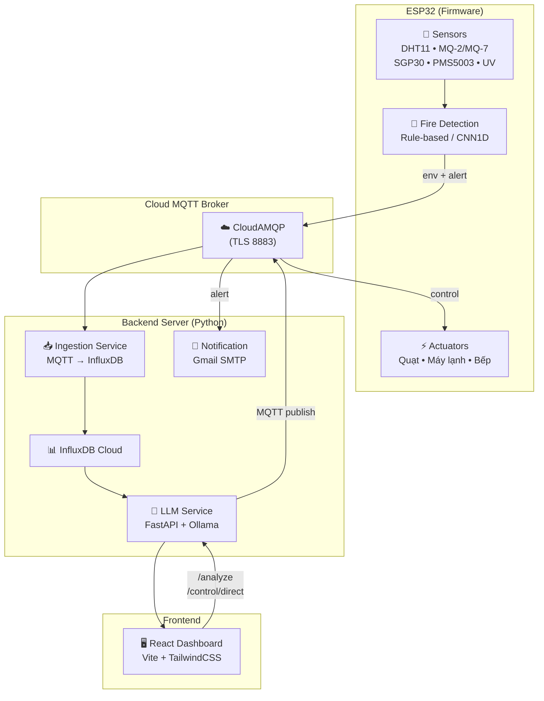
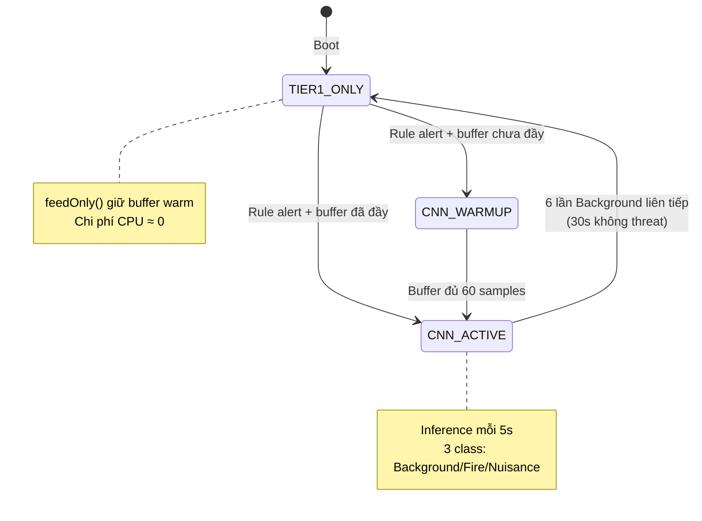
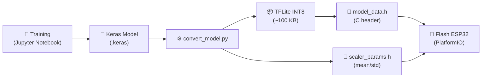
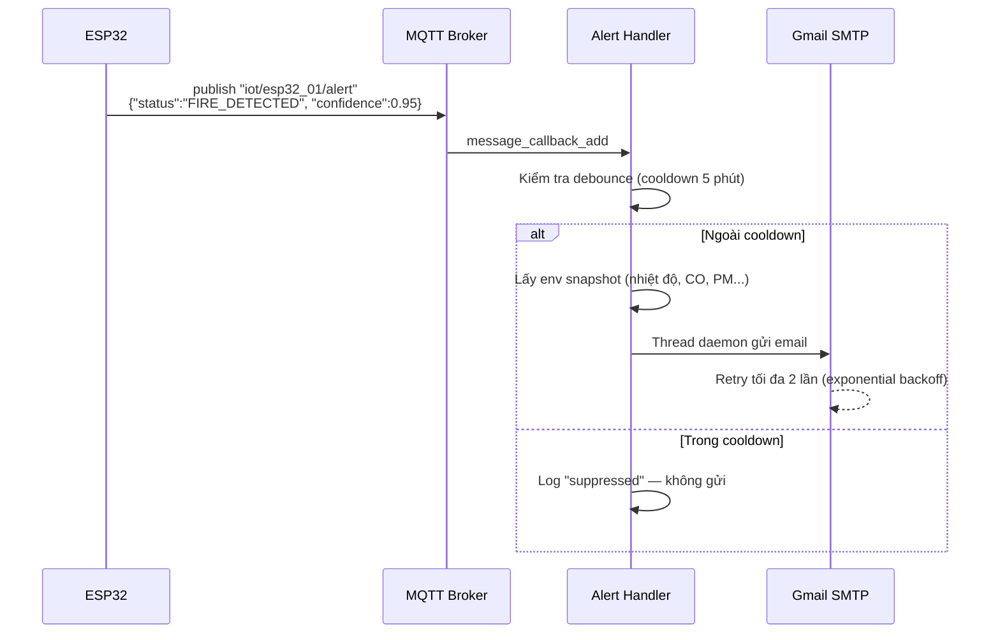
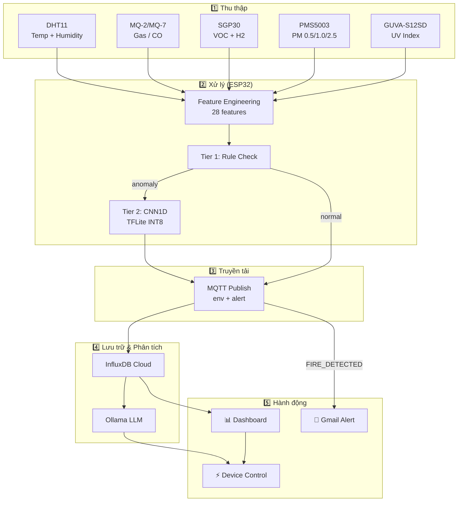

# 🔥 Early Fire Alarm — Tài Liệu Dự Án

> **Hệ thống cảnh báo cháy sớm thông minh** sử dụng ESP32, Machine Learning (CNN1D), LLM Assistant và IoT.

---

## 1. Tổng Quan Dự Án

**Early Fire Alarm** là một hệ thống IoT end-to-end để **phát hiện cháy sớm** trong nhà, kết hợp:

- 🔌 **Phần cứng (ESP32)** — Thu thập dữ liệu cảm biến đa nguồn (nhiệt độ, độ ẩm, khí gas, CO, VOC, PM, UV)
- 🧠 **Machine Learning** — Mô hình CNN1D chạy trực tiếp trên ESP32 (TFLite Micro INT8) để phân loại: *Background*, *Fire*, *Nuisance*
- 🤖 **LLM Chatbot** — Trợ lý AI (Ollama + LangGraph) hỗ trợ hỏi đáp dữ liệu cảm biến và điều khiển thiết bị bằng ngôn ngữ tự nhiên
- 📊 **Dashboard Web** — Giao diện React hiển thị biểu đồ cảm biến real-time và điều khiển thiết bị
- 📧 **Email Alert** — Tự động gửi email cảnh báo cháy qua Gmail SMTP khi phát hiện nguy hiểm

---

## 2. Kiến Trúc Tổng Thể



---

## 3. Cấu Trúc Thư Mục

```
Early Fire Alarm/
├── main.py                         # Entry point — khởi chạy MQTT + FastAPI
├── requirement.txt                 # Python dependencies
├── .env                            # Cấu hình InfluxDB, MQTT, Gmail
│
├── firmware/                       # 🔌 ESP32 firmware (PlatformIO)
│   ├── platformio.ini              # Build config (rule-based / ML mode)
│   ├── convert_model.py            # Keras → TFLite INT8 → C header
│   └── src/
│       ├── main.cpp                # FreeRTOS tasks: sensor + MQTT
│       ├── fire_detector.h         # CNN1D inference engine
│       ├── model_data.h            # TFLite model (auto-generated)
│       └── scaler_params.h         # Scaler parameters (auto-generated)
│
├── services/
│   ├── ingestion/                  # 📥 MQTT → InfluxDB data pipeline
│   │   └── mqtt_to_influxdb.py
│   │
│   ├── llm_service/                # 🤖 LLM Chatbot + REST API
│   │   ├── chat_api.py             # FastAPI endpoints + LangChain tools
│   │   └── log.py                  # Rotating file logger
│   │
│   ├── ml_service/                 # 🧠 ML training pipeline
│   │   ├── eda_indoor_fire.ipynb   # Exploratory Data Analysis
│   │   ├── fire_models_indoor.ipynb # Model training & evaluation
│   │   └── saved_models/          # Keras model, scaler, features
│   │
│   ├── notification/               # 📧 Email alert service
│   │   ├── gmail_alert.py          # Gmail SMTP sender
│   │   └── mqtt_alert_handler.py   # Alert routing + debounce
│   │
│   └── ui/                         # 🖥️ React web dashboard
│       └── src/
│           ├── App.jsx             # Layout chính
│           └── components/
│               ├── SensorCharts.jsx  # Biểu đồ cảm biến
│               ├── ChatPanel.jsx     # Chat AI assistant
│               └── DeviceStatus.jsx  # Điều khiển thiết bị
│
└── data/
    └── Indoor Fire Dataset...csv   # Dataset 44MB (305K rows)
```

---

## 4. Các Thành Phần Chi Tiết

### 4.1. 🔌 Firmware ESP32

> **Ngôn ngữ:** C++ (Arduino Framework) · **Build system:** PlatformIO · **RTOS:** FreeRTOS

#### Hai chế độ biên dịch

| Chế độ | Build Flag | Mô tả | Sensors |
|--------|-----------|-------|---------|
| **Rule-based** | `USE_RULE_BASED=1` | Ngưỡng đơn giản: gas > 1500 hoặc temp > 40°C | DHT11, MQ-2 |
| **ML (CNN1D)** | `USE_TFLITE=1` | CNN1D TFLite INT8 inference trên ESP32 | DHT11, MQ-7, SGP30, PMS5003, UV |

#### FreeRTOS Tasks

| Task | Core | Priority | Chức năng |
|------|------|----------|-----------|
| `taskSensorPublish` | Core 1 | HIGH (3) | Đọc sensor, chạy inference, publish MQTT |
| `taskMQTTReceive` | Core 0 | NORMAL (2) | Nhận lệnh điều khiển GPIO từ MQTT |

#### Hệ thống phát hiện 2 tầng (ML Mode)



- **Tier 1 (Rule-based):** Luôn chạy, chi phí gần 0. Kiểm tra ngưỡng PM_Total > 30, CO > 50 ppm, Temp > 40°C
- **Tier 2 (CNN1D):** Chỉ kích hoạt khi Tier 1 phát hiện bất thường → tiết kiệm năng lượng

#### Điều khiển thiết bị (GPIO)

ESP32 nhận lệnh MQTT trên topic `device/+/control` và điều khiển:

| Thiết bị | GPIO Pin | Device ID |
|----------|----------|-----------|
| Máy lạnh (AC) | GPIO 25 | `ac` |
| Quạt | GPIO 26 | `fan` |
| Bếp điện | GPIO 27 | `stove` |

Sau khi thực thi, ESP32 publish kết quả lên `device/<id>/response` để xác nhận.

#### MQTT Topics

| Topic | Hướng | Nội dung |
|-------|-------|----------|
| `iot/esp32_01/env` | ESP32 → Server | Dữ liệu cảm biến (JSON) |
| `iot/esp32_01/alert` | ESP32 → Server | Cảnh báo cháy + confidence |
| `device/+/control` | Server → ESP32 | Lệnh bật/tắt thiết bị |
| `device/<id>/response` | ESP32 → Server | Xác nhận thực thi lệnh |

---

### 4.2. 🧠 ML Pipeline (`services/ml_service/`)

#### Dataset
- **Indoor Fire Dataset with Distributed Multi-Sensor Nodes** — 305K rows, 44MB
- Multi-sensor: Temperature, Humidity, CO, H2, VOC, PM (0.5/1.0/2.5), UV

#### Feature Engineering (28 features)

| Nhóm | Số lượng | Chi tiết |
|------|----------|----------|
| Base features | 10 | CO, H2, Humidity, PM0.5, PM1.0, PM_Typical, PM_Total, Temperature, UV, VOC |
| Delta features | 5 | Chênh lệch với sample trước (CO, H2, PM05, PM_Total, VOC) |
| Rolling features | 10 | Mean + Std trên cửa sổ 6 samples (cùng 5 sensors) |
| Ratio features | 3 | VOC/CO ratio, PM size ratio, UV normalized |

#### Kiến trúc CNN1D (100,339 parameters)

```
Input (60, 28)
→ BatchNormalization
→ Conv1D(64, k=3, relu) × 2 → AvgPool(2)
→ Conv1D(128, k=3, relu) × 2 → GlobalAvgPool
→ Dense(64, relu)
→ Dense(3, softmax)  →  [Background, Fire, Nuisance]
```

#### Quy trình Deploy lên ESP32



- **INT8 Quantization:** Model float32 → INT8 (giảm ~4x kích thước, tương thích ESP32)
- **Tensor Arena:** ~50KB RAM cho CNN activations
- **Confidence Thresholds:** Fire ≥ 0.45, Nuisance ≥ 0.45 (tuned từ notebook)

---

### 4.3. 📥 Ingestion Service (`services/ingestion/`)

Nhận dữ liệu cảm biến từ MQTT và ghi vào **InfluxDB Cloud**:

- **Subscribe:** `iot/esp32_01/env`, `device/+/response`, `iot/+/alert`
- **Validate:** Kiểm tra dữ liệu hợp lệ (temp 0–60°C, humidity 0–100%, gas 0–4095)
- **Write:** InfluxDB point với measurement `environment`, tags `device`, fields `temperature/humidity/gas`
- **Cache:** Giữ snapshot env mới nhất trong memory (thread-safe) để notification service dùng ngay, không cần query InfluxDB

#### Kết nối

| Service | Protocol | Endpoint |
|---------|----------|----------|
| MQTT Broker | MQTTS (TLS) | `kingfisher.lmq.cloudamqp.com:8883` |
| InfluxDB | HTTPS | `us-east-1-1.aws.cloud2.influxdata.com` |

---

### 4.4. 🤖 LLM Service (`services/llm_service/`)

**FastAPI server** tích hợp **Ollama** (local LLM) qua **LangChain + LangGraph**:

#### API Endpoints

| Method | Path | Chức năng |
|--------|------|-----------|
| `POST` | `/analyze` | Chat với LLM — hỏi đáp cảm biến, ra lệnh thiết bị |
| `POST` | `/control/direct` | Điều khiển thiết bị trực tiếp (bypass LLM) |
| `GET` | `/sensor/history` | Lấy time-series sensor (30 phút, mỗi phút 1 point) |
| `GET` | `/devices/status` | Trạng thái tất cả thiết bị |

#### LLM Agent Tools

LLM Agent có 3 tools để tương tác với hệ thống:

| Tool | Mô tả |
|------|--------|
| `get_sensor_data()` | Query InfluxDB lấy dữ liệu cảm biến mới nhất |
| `control_device()` | Bật/tắt thiết bị IoT qua MQTT (hỗ trợ hẹn giờ) |
| `get_device_status()` | Kiểm tra trạng thái bật/tắt tất cả thiết bị |

#### Tính năng nổi bật

- **Conversation Memory:** Dùng `InMemorySaver` (LangGraph) — LLM nhớ ngữ cảnh hội thoại
- **Hẹn giờ thiết bị:** Hỗ trợ `delay_seconds` hoặc `run_at_iso` qua APScheduler
  - *"Bật quạt sau 10 phút"* → `delay_seconds=600`
  - *"Tắt bếp lúc 6h tối"* → `run_at_iso="2026-05-30T18:00:00"`
- **Time Context Injection:** Tự động inject thời gian thực vào mỗi message để LLM xử lý đúng các biểu thức thời gian mơ hồ
- **ACK từ ESP32:** Sau khi gửi lệnh MQTT, server chờ response từ ESP32 (timeout 5s) để xác nhận trạng thái thiết bị chính xác
- **Logging:** RotatingFileHandler (5MB × 3 backups) ghi lại toàn bộ user messages, tool calls, và assistant responses

---

### 4.5. 📧 Notification Service (`services/notification/`)

Tự động gửi **email cảnh báo cháy** khi ESP32 publish alert:

#### Luồng xử lý



#### Tính năng

| Feature | Chi tiết |
|---------|----------|
| **Debounce** | Cooldown 300s (5 phút) giữa các email, tránh spam |
| **Async** | Gửi trong daemon thread, không block MQTT loop |
| **Retry** | Tối đa 2 lần retry với exponential backoff (2s, 4s) |
| **HTML + Plain text** | Email đẹp với bảng cảm biến, có fallback plain text |
| **Snapshot** | Đính kèm chỉ số cảm biến tại thời điểm phát hiện |
| **Graceful fallback** | Thiếu config Gmail → log warning, không crash hệ thống |

---

### 4.6. 🖥️ Web Dashboard (`services/ui/`)

**React + Vite + TailwindCSS + Recharts**

#### Layout

```
┌──────────────────────────────────────────────────┐
│  🔥 Early Fire Alarm    [● MQTT] [● API]         │
├─────────────────────────┬────────────────────────┤
│                         │  ⚡ Thiết bị            │
│  🌡️ Nhiệt độ (AreaChart)│  💨Quạt  ❄️AC  🔥Bếp   │
│  💧 Độ ẩm   (AreaChart) │  [Bật] [Tắt] mỗi cái  │
│  💨 Khí Gas (AreaChart) │                        │
│                         │  🤖 Trợ lý AI          │
│  Auto-refresh mỗi 10s  │  Chat gõ lệnh tự nhiên │
│  Dữ liệu 30 phút qua   │  "Bật quạt giúp tôi"  │
│                         │  "Nhiệt độ bao nhiêu?" │
└─────────────────────────┴────────────────────────┘
```

#### Components

| Component | Chức năng |
|-----------|-----------|
| `SensorCharts` | 3 AreaChart (Recharts) cho nhiệt độ, độ ẩm, gas — poll `/sensor/history` mỗi 10s |
| `DeviceStatus` | Card điều khiển 3 thiết bị (Quạt, AC, Bếp) — poll `/devices/status` mỗi 5s, gửi lệnh qua `/control/direct` |
| `ChatPanel` | Chat AI với suggested prompts, typing indicator, conversation memory |

---

## 5. Data Flow — Luồng Dữ Liệu



---

## 6. Technology Stack

| Layer | Công nghệ |
|-------|-----------|
| **MCU** | ESP32 (Ai-Thinker, 4MB Flash) |
| **Framework** | Arduino + FreeRTOS |
| **Build** | PlatformIO |
| **ML Inference** | TensorFlow Lite Micro (INT8) |
| **ML Training** | TensorFlow/Keras (Python, Jupyter) |
| **Communication** | MQTT over TLS (paho-mqtt / PubSubClient) |
| **MQTT Broker** | CloudAMQP (kingfisher.lmq.cloudamqp.com) |
| **Time-series DB** | InfluxDB Cloud 3.0 |
| **Backend** | Python, FastAPI, Uvicorn |
| **LLM** | Ollama (local), LangChain, LangGraph |
| **Scheduling** | APScheduler |
| **Notification** | Gmail SMTP (App Password) |
| **Frontend** | React 19, Vite 8, TailwindCSS 4 |
| **Charts** | Recharts |
| **Environment** | python-dotenv |

---

## 7. Cách Chạy Dự Án

### 7.1. Backend (Python)

```bash
# Cài dependencies
pip install -r requirement.txt

# Đảm bảo Ollama đang chạy với model loaded
ollama run <model_name>

# Chạy server (MQTT + FastAPI trên port 8000)
python main.py
```

### 7.2. Frontend (React)

```bash
cd services/ui
npm install
npm run dev     # Vite dev server
```

### 7.3. Firmware (ESP32)

```bash
cd firmware

# Rule-based mode (hardware hiện tại)
pio run -e esp32dev -t upload

# ML mode (cần sensor đầy đủ)
python convert_model.py     # Sinh model_data.h + scaler_params.h
pio run -e esp32dev-ml -t upload
```

---

## 8. Tóm Tắt Chức Năng

| # | Chức năng | Mô tả |
|---|-----------|-------|
| 1 | **Thu thập dữ liệu cảm biến** | ESP32 đọc 5+ loại sensor, gửi qua MQTT mỗi 1–5s |
| 2 | **Phát hiện cháy (Rule-based)** | Ngưỡng đơn giản: gas, CO, nhiệt độ |
| 3 | **Phát hiện cháy (AI/ML)** | CNN1D TFLite INT8 chạy trên ESP32, 28 features, 3 classes |
| 4 | **Hệ thống 2 tầng** | Tier 1 (rule) luôn chạy → kích hoạt Tier 2 (CNN) khi cần, tiết kiệm năng lượng |
| 5 | **Lưu trữ time-series** | Dữ liệu sensor → InfluxDB Cloud, query lịch sử |
| 6 | **Dashboard real-time** | Biểu đồ nhiệt độ/độ ẩm/gas cập nhật mỗi 10s |
| 7 | **Điều khiển thiết bị IoT** | Bật/tắt Quạt, Máy lạnh, Bếp qua UI hoặc chat |
| 8 | **Trợ lý AI (LLM)** | Chat tiếng Việt, hỏi cảm biến, ra lệnh, hẹn giờ thiết bị |
| 9 | **Hẹn giờ thiết bị** | "Bật quạt sau 10 phút", "Tắt bếp lúc 6h tối" |
| 10 | **Email cảnh báo cháy** | Gmail tự động khi phát hiện cháy, có debounce 5 phút |
| 11 | **ACK thiết bị** | ESP32 xác nhận thực thi lệnh, UI hiển thị trạng thái chính xác |
| 12 | **Logging toàn diện** | RotatingFileHandler cho LLM service và notification |
