# Demo Mode — CNN1D Inference trên ESP32 + Dashboard Label Visualization

## Mục tiêu

Thêm chế độ **Demo Mode** (`USE_DEMO=1`) cho ESP32 firmware: phát lại dữ liệu cảm biến từ dataset qua CNN1D TFLite inference trên phần cứng thật. Dashboard hiển thị biểu đồ đổi màu theo ground truth label với ngưỡng chuyển đổi rõ ràng. Không cần sensor đầy đủ — chỉ cần ESP32.

---

## Chuỗi demo data

Dataset có đoạn liên tiếp hoàn hảo quanh rows 155240–158387:

```
Background → Nuisance → Background → Fire
(155242)      (155262)    (157735)     (158357)
```

| Giai đoạn | Rows dataset | Số samples | Vai trò |
|-----------|-------------|-----------|---------|
| 🟢 Background | 155242–155261 | **20** | CNN warmup — 18 step đầu buffer chưa đủ, chưa inference |
| 🟡 Nuisance | 155262–155281 | **20** | Khói nấu ăn / nến — CNN bắt đầu detect từ step 18 |
| 🟢 Background | 157735–157764 | **30** | Trở lại bình thường |
| 🔴 Fire | 158357–158386 | **30** | Cháy thật |
| | | **= 100 samples** | **~8.3 phút demo (5s/step)** |

### Timeline

```
Step:  0───────17 18─19 20──────39 40───────69 70──────99  100
       │ WARMUP │       │         │           │          │
       │ buffer │  CNN  │  CNN    │   CNN     │  CNN     │ DỪNG
       │ filling│  bắt  │  chạy   │   chạy    │  chạy    │
       │(no inf)│  đầu  │         │           │          │
Label: 🟢BG(20)    🟡Nuisance(20)  🟢BG(30)   🔴Fire(30)
                ↑                 ↑          ↑
          ngưỡng 1          ngưỡng 2    ngưỡng 3
```

---

## Quy trình dữ liệu: Dataset → CNN → Dashboard

```mermaid
graph LR
    subgraph "PC (chạy 1 lần)"
        CSV["📄 Dataset CSV"] --> SCRIPT["⚙️ extract_demo_data.py"] --> HDR["📦 demo_sequences.h"]
    end

    subgraph "ESP32 (mỗi 5s)"
        HDR --> READ["1. Đọc 10 raw sensors<br/>từ flash"]
        READ --> PUSH["2. push() →<br/>Feature Engineering<br/>10 → 28 features"]
        PUSH --> SCALE["3. StandardScaler<br/>normalize"]
        SCALE --> BUF["4. Ghi circular buffer<br/>18 × 28"]
        BUF --> CNN["5. CNN1D INT8<br/>inference (khi ≥18)"]
        CNN --> PUB["6. Publish MQTT"]
    end

    subgraph "Backend"
        PUB --> INGEST["📥 Ingestion<br/>→ InfluxDB"]
        INGEST --> API["🔌 /sensor/history<br/>+ ground_truth"]
    end

    subgraph "Dashboard"
        API --> CHART["📊 Biểu đồ<br/>đổi màu theo label<br/>+ ngưỡng chuyển đổi"]
    end
```



### Bên trong `FireDetector::push()` (step ≥ 18):

```
10 raw sensor values (CO, H2, Humidity, PM05, PM10, PM_Typical, PM_Total, Temp, UV, VOC)
  │
  ├── [0-9]   10 Base features (raw values, thứ tự alphabetical)
  ├── [10-14]  5 Delta features (diff vs sample trước, fillna(0) cho step đầu)
  ├── [15-24] 10 Rolling features (mean + std trên 6 samples gần nhất)
  └── [25-27]  3 Ratio features (VOC/CO, PM_size, UV_norm)
  │
  = 28 features
  │
  StandardScaler: x_scaled = (x_raw - kScalerMean[i]) × kScalerStdInv[i]
  │
  Ghi vào circular buffer feature_buf_[head_] (18 × 28)
  │
  Khi buffer ≥ 18 steps → runInference():
    Input int8[1][18][28] → BatchNorm → Conv1D(64)×2 → AvgPool
    → Conv1D(128)×2 → GlobalAvgPool → Dense(64) → Dense(3, softmax)
    → Output: [prob_bg, prob_fire, prob_nuis]
    → Threshold: Fire ≥ 0.45, Nuisance ≥ 0.45 (else → Background)
```

---

## Proposed Changes

### ① Script trích xuất demo data

#### [NEW] [extract_demo_data.py](file:///home/sinhdang/Documents/PlatformIO/Projects/Early%20Fire%20Alarm/firmware/extract_demo_data.py)

Script Python chạy trên PC:
- Đọc dataset CSV
- Trích 100 samples từ 4 đoạn: BG(20) → Nuisance(20) → BG(30) → Fire(30)
- Xuất 10 raw sensor values + ground truth label + transition indices
- Output: `firmware/src/demo_sequences.h`

> [!NOTE]
> Script chỉ xuất raw values — `FireDetector::push()` tự compute 28 features + scale + inference.

---

### ② Demo data header

#### [NEW] [demo_sequences.h](file:///home/sinhdang/Documents/PlatformIO/Projects/Early%20Fire%20Alarm/firmware/src/demo_sequences.h)

Auto-generated, chứa:
```cpp
constexpr int kDemoTotalSteps = 100;

// Ground truth label per step (0=Background, 1=Fire, 2=Nuisance)
const uint8_t kDemoLabels[100] PROGMEM = { 0,0,..., 2,2,..., 0,0,..., 1,1,... };

// Transition points: step index + label name
constexpr int kDemoTransitionSteps[] = {0, 20, 40, 70};
const char* const kDemoTransitionNames[] = {"Background", "Nuisance", "Background", "Fire"};
constexpr int kDemoTransitionCount = 4;

// [step][10 raw sensors]: CO, H2, Humidity, PM05, PM10, PM_Typical, PM_Total, Temp, UV, VOC
const float kDemoData[100][10] PROGMEM = { ... };
```

Kích thước: `100 × 10 × 4 = 4,000 bytes` + labels ≈ **4.1KB flash**.

---

### ③ Build config

#### [MODIFY] [platformio.ini](file:///home/sinhdang/Documents/PlatformIO/Projects/Early%20Fire%20Alarm/firmware/platformio.ini)

Thêm `[env:esp32dev-demo]`:
```ini
[env:esp32dev-demo]
extends       = common
board         = esp32dev
upload_port   = /dev/ttyUSB0
board_build.partitions = huge_app.csv
build_flags =
  -DCORE_DEBUG_LEVEL=3
  -DUSE_TFLITE=1
  -DUSE_DEMO=1
  -DTENSOR_ARENA_SIZE=50*1024
lib_deps =
  ${common.lib_deps_base}
  https://github.com/tensorflow/tflite-micro-arduino-examples
```

---

### ④ Demo playback task

#### [MODIFY] [main.cpp](file:///home/sinhdang/Documents/PlatformIO/Projects/Early%20Fire%20Alarm/firmware/src/main.cpp)

Thêm `#if defined(USE_TFLITE) && defined(USE_DEMO)` block — task riêng cho demo:

**Logic:**
1. `setup()`: gọi `fireDetector.begin()` ngay lập tức (không lazy init)
2. Task loop mỗi 5s:
   - Đọc `kDemoData[step]` → 10 raw sensors
   - Đọc `kDemoLabels[step]` → ground truth
   - Tính `temperature = kDemoData[step][7]`, `humidity = [2]`, `gas = PM_Total = [6]`
   - Gọi `fireDetector.push(...)` → inference khi step ≥ 18
   - Publish MQTT:
     ```json
     {
       "device": "ESP32_01",
       "temperature": 25.3,
       "humidity": 51.5,
       "gas": 17,
       "ground_truth": "Background",
       "demo_step": 5,
       "demo_total": 100,
       "ml_class": "warming_up",
       "fire_alert": false,
       "mode": "demo_playback"
     }
     ```
   - Khi step ≥ 18 (inference active), payload thêm:
     ```json
     {
       "ml_class": "FIRE",
       "ml_confidence": 0.932,
       "prob_bg": 0.023, "prob_fire": 0.932, "prob_nuis": 0.045
     }
     ```
3. Khi `step == 100` → publish `{"status":"DEMO_COMPLETE"}` → `vTaskDelete(NULL)` (dừng hẳn)
4. **Không đọc DHT11/MQ2** — tất cả giá trị từ dataset

---

### ⑤ Ingestion hỗ trợ demo payload

#### [MODIFY] [mqtt_to_influxdb.py](file:///home/sinhdang/Documents/PlatformIO/Projects/Early%20Fire%20Alarm/services/ingestion/mqtt_to_influxdb.py)

- Sửa `is_valid()`: nếu `mode == "demo_playback"` → skip validate gas range
- Thêm fields vào InfluxDB point: `ground_truth`, `ml_class`, `ml_confidence`, `mode`
- Giữ nguyên `temperature`, `humidity`, `gas`

---

### ⑥ API trả ground_truth

#### [MODIFY] [chat_api.py](file:///home/sinhdang/Documents/PlatformIO/Projects/Early%20Fire%20Alarm/services/llm_service/chat_api.py) — endpoint `/sensor/history`

- Thêm `ground_truth`, `ml_class` vào SELECT query
- Response mỗi data point thêm:
  ```json
  { "ground_truth": "Fire", "ml_class": "FIRE" }
  ```

---

### ⑦ Biểu đồ đổi màu theo label

#### [MODIFY] [SensorCharts.jsx](file:///home/sinhdang/Documents/PlatformIO/Projects/Early%20Fire%20Alarm/services/ui/src/components/SensorCharts.jsx)

**3 thay đổi UI:**

1. **Nền chart đổi màu theo `ground_truth`** (dùng Recharts `ReferenceArea`):
   - 🟢 `rgba(34,197,94,0.08)` khi Background
   - 🟡 `rgba(234,179,8,0.12)` khi Nuisance
   - 🔴 `rgba(239,68,68,0.12)` khi Fire

2. **Đường ngưỡng dọc tại transition** (dùng `ReferenceLine`):
   - Đường dọc + label text (ví dụ: "→ Fire") tại thời điểm ground_truth thay đổi

3. **Detect transitions từ data:**
   ```js
   const transitions = data.reduce((acc, pt, i) => {
     if (i > 0 && pt.ground_truth !== data[i-1].ground_truth) {
       acc.push({ time: pt.time, label: pt.ground_truth });
     }
     return acc;
   }, []);
   ```

**Mockup:**
```
┌──────────────────────────────────────────────────────────────┐
│ 🌡️ Nhiệt độ                                          25.3°C │
├────────────┬──────────┬─────────────────┬────────────────────┤
│ 🟢 BG     │→🟡Nuis   │→ 🟢 BG          │→ 🔴 Fire          │
│ ╭──╮      ┊ ╭────╮   ┊   ╭──╮         ┊      ╭────────╮   │
│─╯  ╰──────┊─╯    ╰───┊───╯  ╰─────────┊──────╯        ╰── │
│            ┊          ┊                ┊                    │
└────────────┴──────────┴─────────────────┴────────────────────┘
  14:20         14:22        14:24           14:28    14:32
             ↑ ngưỡng    ↑ ngưỡng        ↑ ngưỡng
```

---

## Không thay đổi

| File | Lý do |
|------|-------|
| `fire_detector.h` | push() API đã đúng, demo chỉ feed data khác |
| `model_data.h`, `scaler_params.h` | Đã generate, giữ nguyên |
| `ChatPanel.jsx`, `DeviceStatus.jsx` | Không liên quan |
| `gmail_alert.py`, `mqtt_alert_handler.py` | Không liên quan |

---

## Verification Plan

### Build & Flash
```bash
cd firmware
python extract_demo_data.py               # Sinh demo_sequences.h
pio run -e esp32dev-demo                   # Compile
pio run -e esp32dev-demo -t upload         # Flash
```

### Serial Monitor (115200)
- `[Setup] CNN1D initialized for demo mode`
- Step 0–17: `[DEMO] Step 5/100 | GT: Background | ML: warming_up`
- Step 18+: `[DEMO] Step 25/100 | GT: Nuisance | ML: NUISANCE (0.87) | prob [0.05, 0.08, 0.87]`
- Step 70+: `[DEMO] Step 75/100 | GT: Fire | ML: FIRE (0.93) | prob [0.02, 0.93, 0.05]`
- Step 100: `[DEMO] ✓ DEMO_COMPLETE — task stopped`

### Dashboard
- Biểu đồ nhiệt độ/độ ẩm/gas cập nhật mỗi 5s từ dataset
- Nền đổi màu 🟢→🟡→🟢→🔴
- Đường ngưỡng dọc tại 3 transition points
- `ml_class` hiển thị kết quả CNN (có thể khác ground_truth — điều này bình thường)
